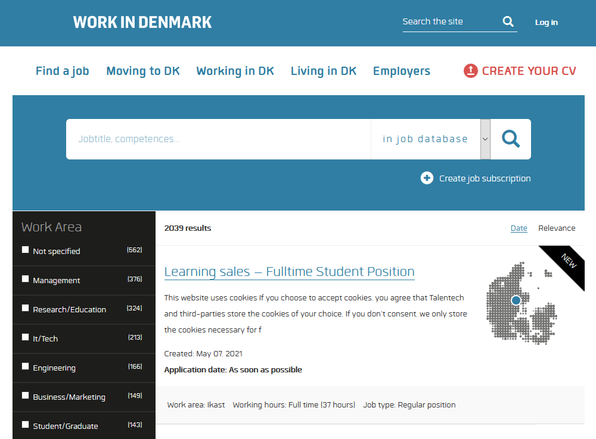
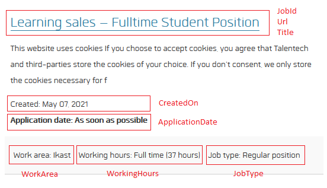
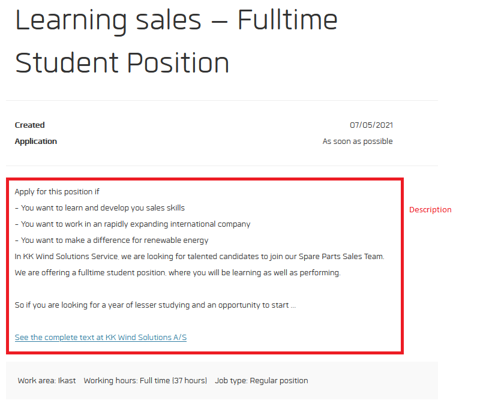
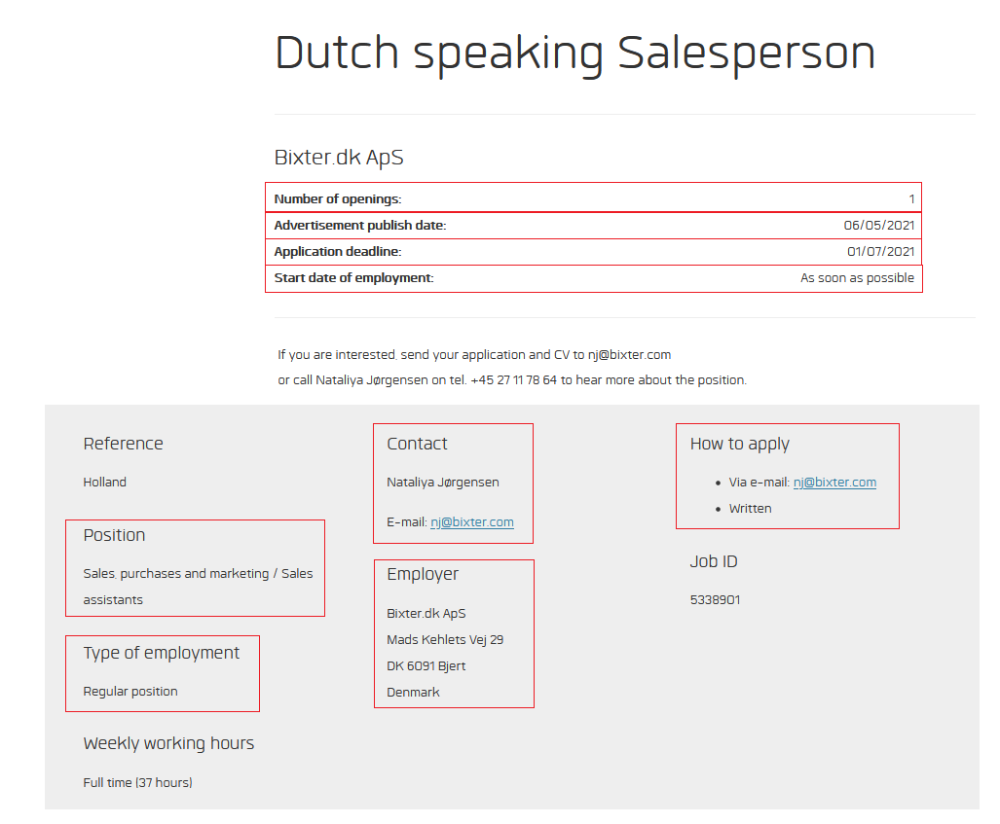

# NW.WIDJobs
Contact: numbworks@gmail.com

## Revision History

| Date | Author | Description |
|---|---|---|
| 2021-05-08 | numbworks | Created. |

## Introduction

`NW.WIDJobs` is a `.NET Standard 2.0` library written in `C#` to explore `WorkInDenmark.dk` and fetch the most recent job ads published. 

## The page URLs

The exploration of `WorkInDenmark.dk` starts from an initial page, which can have three different URLs:

|Criteria|Url|
|---|---|
|`Default`|`https://www.workindenmark.dk/Search/Job-search?q=`|
|`OrderedByDate`|`https://www.workindenmark.dk/Search/Job-search?q=&orderBy=date`|
|`OrderedByRelevance`|`https://www.workindenmark.dk/Search/Job-search?q=&orderBy=`|

The subsequent pages have the following URLs instead:

|Criteria|Url|
|---|---|
|`OrderedByDate`|`https://www.workindenmark.dk/Search/Job-search?q=&orderBy=date&PageNum={pageNumber}&`|
|`OrderedByRelevance`|`https://www.workindenmark.dk/Search/Job-search?q=&orderBy=&PageNum={pageNumber}`|

For the scope of beginning the exploration of the website they are all equivalent, but we do use the the `OrderedByDate` variants.

## The object model

The three objects that have been identified during the exploration of `WorkInDenmark.dk` are the following ones:

- `Page`
- `PageItem`
- `PageItemExtended`

The relationship between these objects is summarized in the diagram below:


## The exploration

The exploration starts from the initial page, which returns something like this:



Every page has twenty `PageItems`:



Each `PageItem` provides the preliminary information about the job ad, which are:

- `JobId`
- `Url`
- `Title`
- `CreatedOn`
- `WorkArea`
- `WorkingHours`
- `JobType`

The `Url` brings us to the a `PageItemExtended`, which represents the job ad with the highest amount of information possible. The amount of informational fields provided by the job ad varies considerably, but in the basic case the `PageItemExtended` will contain the same fields found in the original `PageItem` plus the `Description`:



The following is an example of an `PageItemExtended` containing more fields:



...

## The Page object

Every "search result" page contains the number of total results:

```html
...
<!-- Ordering -->
<div class="row" style="padding:15px 0;">
    <div class="col-sm-6">

        
            <strong><strong>2033</strong> results</strong>
        
    </div>
    <div class="col-sm-6">
        <div class="pull-sm-right pull-md-right pull-lg-right">
            <span class="hidden">Order by:</span>
            Date
                        &nbsp;
                        <a href="?q=&orderBy=">Relevance</a>
            
        </div>
    </div>
</div>

<!-- Filter etc. -->
...
```
The XPath pattern to scrape the information out of a page are the following ones:

|Field|Pattern|
|---|---|
|`TotalResults`|`//div[@class='col-sm-9 ']/h1/a/@href`|

The following information are derivative:

|Field|Action|
|---|---|
|`TotalEstimatedPages`|Calculated out of `TotalResults` / 20.|

The following information require extra processing:

|Field|Action|
|---|---|
|`TotalResults`|Parse it to `uint`.|
|`TotalEstimatedPages`|Parse it to `ushort`.|

## The PageItem object

Every page contains twenty (or less, if it's the last page) objects like the following one:

```html
...
<!-- JobResultItemView.ascx -->
<section class="job-item search-new">
    <div class="job-body ">
		  <div class="row nomargin">
				<div class="col-sm-12">

		          <div class="row ">
            <div class="col-sm-9 ">
                <h1><a class="search-link underline visited" href="/job/8148174/Technology-Finance-Business-Partner">Technology Finance Business Partner<small class="visited-text"> &nbsp;</small></a></h1>
                <p> 
Technology Finance Business Partner
Denmark Copenhagen Local Finance/Accounting Last application date: 28/5/2021
A.P. Moller - Maersk is an integrated container logistics company. Connecting and sim</p>
                <p>
                    Created: <time datetime="2021-05-09">May 09, 2021</time>
                    <br />
                    <strong>Application date: <time datetime="2021-05-28">May 28, 2021</time></strong></p>
            </div>
            <div class="col-sm-3 ">
                <div class="dkmap-holder">
                    
                    <div class="spot-capitalregionofdenmark"></div>
                </div>
                
            </div>
        </div>

				</div>
		  </div>
    </div>
    <div class="data-list">
		  <div class="row nomargin">
				<div class="col-sm-12">
					 <ul class="list-inline">
						  <li>Work area: København</li>
						  <li>Working hours: Full time (37 hours)</li>
						  <li>Job type: Regular position</li>
					 </ul>
				</div>
		  </div>
    </div>
</section>
<!-- /JobResultItemView.ascx -->
...
```

The XPath patterns to scrape all the `PageItem` fields are the following ones:

|Type|Field|Pattern|
|---|---|---|
|`Mandatory`|`Url`|`//div[@class='col-sm-9 ']/h1/a/@href`|
|`Mandatory`|`Title`|`//div[@class='col-sm-9 ']/h1`|
|`Mandatory`|`CreateDate`|`//div[@class='col-sm-9 ']/p[contains(.,'Created')]/time/@datetime`|
|`Optional`|`ApplicationDate`|`//div[@class='col-sm-9 ']/p[contains(.,'Application date')]/strong`|
|`Mandatory`|`WorkArea`|`//ul[@class='list-inline']/li[contains(.,'Work area')]`|
|`Mandatory`|`WorkingHours`|`//ul[@class='list-inline']/li[contains(.,'Working hours')]`|
|`Mandatory`|`JobType`|`//ul[@class='list-inline']/li[contains(.,'Job type')]`|

The following fields are derivative:

|Field|Action|
|---|---|
|`WorkAreaWithoutZone`|`WorkArea` without zone or `WorkArea`.|
|`PageItemNumber`|Equals to the item's position in the list increased by 1.|
|`JobId`|Extract it from `Url`.|
|`PageItemId`|`JobId` and `Title` combined.|

The following fields require extra processing:

|Field|Action|
|---|---|
|`Url`|Convert from relative to absolute.|
|`Title`|Remove `&nbsp;`.|
|`CreateDate`|Parse it to `DateTime`.|
|`ApplicationDate`|Remove `Application date: ` and parse it to `DateTime` when it's a date, or set it to `null` when it's "As soon as possible".|
|`WorkArea`|Remove `Work area: `.|
|`WorkingHours`|Remove `Working hours: `.|
|`JobType`|Remove `Job type: `.|
|`JobId`|Parse it to `ulong`.|

The `WorkAreaWithoutZone` field is required, because in many cases `WorkArea` comes with the "zone" suffix by default, which could limit further data processing activities on the `PageItem` objects such as grouping. Here some of the most common cases:

|WorkArea|WorkAreaWithoutZone|
|---|---|
|København K|København|
|Kgs. Lyngby|Kgs. Lyngby|
|København V|København|
|København Ø|København|
|København S|København|
|Aarhus C|Aarhus|
|Viby J|Viby|
|Odense S|Odense|
|Kongens Lyngby|Kongens Lyngby|
|Billund|Billund|
|København SV|København|
|Esbjerg V|Esbjerg|
|Odense SØ|Odense|
|Lem St|Lem|

## The PageItemExtended object

`Description` with `SeeCompleteTextAt`:

```html
...
<hr class="margin" />

<div class="row">
    <div class="col-sm-11">

        <div class="JobPresentation job-description">
                <br>Technology Finance Business Partner<br>Denmark Copenhagen Local Finance/Accounting Last application date: 28/5/2021<br>A.P. Moller - Maersk is an integrated container logistics company. Connecting and simplifying trade to help our customers grow and thrive. With a dedicated team of over 76,000, operating in 130 countries; we go all the way to enable global trade for a growing world. <br><br>We, being an equal opportunity employer, are renowned for our dedicated and professional staff and global career opportunities. An opportunity is now available for a career-minded individual to join us as a Technology Finance Business Partner – Technology Infrastructure Engineering & Service Operations.<br><br>Technology will enable our digital transformation, drive more customer value, improve business performance and create operational synergies, to help realize our vision of becoming the Global Integrator of container logistics, connecting and simplifying our customers' supply chain. The Maersk Group is on the l...
        </div>

        <a href="https://jobsearch.maersk.com/jobposting/index.html?id=MA-268026" target="_blank">See the complete text at A.P. Møller - Mærsk A/S</a>


    </div>
</div>
...
```

`Description` without `SeeCompleteTextAt`:

```html
...
<div class="row">
    <div class="col-sm-11">
        <div id="jobDescription" class="job-description">
            <p>Bixter.dk ApS in Kolding is looking for several new talented salespeople for the Dutch market.</p><br /><p> </p><br /><p><strong>About the position:</strong></p><br /><p>Bixter.dk ApS is dealing with English- and German-speaking workforce worldwide. We currently have a strong focus on the agricultural area in the Netherlands, which is the reason why we are looking for you!</p><br /><p> </p><br /><p><strong>About you...</strong></p><br /><p>You either have experience from a previous position of telephone sales, cold-calling or have the courage to learn it.</p><br /><p>You can imagine an everyday life where your phone is your most important work tool.</p><br /><p>You are smiley, openminded and outgoing by nature.</p><br /><p>You can easily start a conversation over the phone with people you do not know.</p><br /><p>You are persistent, and do not give up, even if you experience a lot of resistance in the procedure of selling.</p><br /><p>You have the ambition and aspiration in the long run, to become a top salesperson, coach, or leader in one of our ever-growing departments. You speak and write English and Dutch fluently.</p><br /><p>As a seller with us, your most important task will be to contact all types of farmers, employers in the Netherlands over the phone. You must enter into agreements with them in relation to cooperation on the dissemination of English-speaking agricultural trainees from several different countries. You will receive internal sales training, and for the right person, there are many opportunities to grow together with us.</p><br /><p> </p><br /><p><strong>We can offer:</strong></p><br /><p>New and modern premises in a rural setting and with a view to Kolding-fjord.</p><br /><p>Skilled, sales-oriented colleagues who help each other and have a good humor.</p><br /><p>An office with high ceilings, where everyone is welcomed regardless of culture, religion and hair color.</p><br /><p>Lunch arrangement and social events, Christmas lunch and cozy evenings with dinner and such.</p><br /><p>Salary is agreed at the job interview and depends on experience and qualifications ...</p><br /><p> </p><br /><p>If you are interested, send your application and CV to nj@bixter.com</p><br /><p>or call Nataliya Jørgensen on tel. +45 27 11 78 64 to hear more about the position.</p><br />
        </div>
        <br />
...
```

`EmployerName`:

```html
...
<div id="scphpage_0_scphcontent_1_ctl00_uiEntireJobPostingSpan">
		<hr />

					
					<h2>
						DINEX A/S
					</h2>
...
```

`NumberOfOpenings`, `AdvertisementPublishDate`, `ApplicationDeadline` and `StartDateOfEmployment`:

```html
...
<div class="row">
    <div class="col-sm-11 ">

        <dl class="dl-justify nomargin">
            <dt>
                Number of openings:
            </dt>
            <dd>
                    1
                
            </dd>

            <dt>
                Advertisement publish date:
            </dt>
            <dd>
                    07/05/2021
                
            </dd>
            <dt>
                Application deadline:
            </dt>
            <dd>
                    07/06/2021
                
            </dd>
            <dt>
                Start date of employment:

            </dt>
            <dd>
                    As soon as possible
                
            </dd>
        </dl>

    </div>
</div>
...
```

`Reference`, `Position`, `TypeOfEmployment`, `Contact`, `EmployerAddress` and `HowToApply`:

```html
...
<aside>
    <div class="row row-wide aside padding-left-extra">
        <div class="col-sm-12">

            <div class="row">
                <div class="col-ms-6 col-sm-4">


                    
                    <p>
                        
                        
                    </p>
                    <h3 id="scphpage_0_scphcontent_1_ctl00_H1">
                        Position
                    </h3>
                    <p>
                        Academical work / Engineering professionals
                    </p>
                    <h3>
                        Type of employment
                    </h3>
                    <p>
                        Regular position
                        
                    </p>
                    <h3>
                        Weekly working hours
                    </h3>
                    <p>
                        Full time (37 hours)
                        
                    </p>
                    
                    <p>
                        
                        
                    </p>
                </div>
                <div class="col-ms-6 col-sm-4">

                    <h3>
                        Contact
                    </h3>
                    <p>
                        <span id="scphpage_0_scphcontent_1_ctl00_uiContactNameSpan">
                            Global Test Centre Manager Christian Berg Philipp<br />
                        </span>
                    </p>
                    
                    
                    <h3 id="scphpage_0_scphcontent_1_ctl00_uiEmployerHeading">
                        Employer
                    </h3>
                    <p id="scphpage_0_scphcontent_1_ctl00_uiEmployerAddressSpan">
                        DINEX A/S<br />
                        Fynsvej 39<br />
                        DK 5500 Middelfart<br />
                        Denmark<br />
                    </p>
                    <p id="scphpage_0_scphcontent_1_ctl00_uiEmployerWebSiteSpan">
                        Website:
                        <a id="scphpage_0_scphcontent_1_ctl00_uiEmployerWebSiteContent" href="https://www.dinex.net/">www.dinex.net/</a>
                    </p>
                    

                </div>
                <div class="col-ms-6 col-sm-4">
                    <h3 id="scphpage_0_scphcontent_1_ctl00_uiHowToApplyHeading">
                        How to apply
                    </h3>
                    <ul>
                        
                        
                        
                        <li id="scphpage_0_scphcontent_1_ctl00_uiHowToApplyOnlineSpan"><span style="word-wrap: break-word">
                            Online:
                            <a id="scphpage_0_scphcontent_1_ctl00_uiLnkHowToApplyOnline" href="https://dinex.career.emply.com/ad/nvh-test-engineer/03leyh" target="_blank">Application form</a><br />
                        </span></li>
                    </ul>
                    
                    <h3>
                        Job ID
                    </h3>
                    <p>
                        5340215
                    </p>
                </div>

            </div>
        </div>

    </div>
</aside>
...
```
The XPath patterns to scrape all the `PageItemExtended` fields are the following ones:

|Type|Field|Pattern|
|---|---|---|
|`Mandatory`|`Description`|`//div[@class='row']/div[@class='col-sm-11']/div[@class='JobPresentation job-description' or @class='job-description']`|
|`Optional`|`DescriptionSeeCompleteTextAt`|`//div[@class='row']/div[@class='col-sm-11']/a/@href`|
|`Optional`|`DescriptionBulletPoints`|`//div[@class='row']/div[@class='col-sm-11']/div[@class='JobPresentation job-description' or @class='job-description']/ul/li`|
|`Optional`|`EmployerName`|`//div[@id='scphpage_0_scphcontent_1_ctl00_uiEntireJobPostingSpan']/h2`|
|`Optional`|`NumberOfOpenings`|`//div[@class='col-sm-11 ']/dl[@class='dl-justify nomargin']/dt[contains(.,'Number of openings')]/following-sibling::dd[1]`|
|`Optional`|`AdvertisementPublishDate`|`//div[@class='col-sm-11 ']/dl[@class='dl-justify nomargin']/dt[contains(.,'Advertisement publish date')]/following-sibling::dd[1]`|
|`Optional`|`ApplicationDeadline`|`//div[@class='col-sm-11 ']/dl[@class='dl-justify nomargin']/dt[contains(.,'Application deadline')]/following-sibling::dd[1]`|
|`Optional`|`StartDateOfEmployment`|`//div[@class='col-sm-11 ']/dl[@class='dl-justify nomargin']/dt[contains(.,'Start date of employment')]/following-sibling::dd[1]`|
|`Optional`|`Reference`|`//div[@class='col-ms-6 col-sm-4']/h3[contains(., 'Reference')]/following-sibling::p[1]`|
|`Optional`|`Position`|`//div[@class='col-ms-6 col-sm-4']/h3[contains(., 'Position')]/following-sibling::p[1]`|
|`Optional`|`TypeOfEmployment`|`//div[@class='col-ms-6 col-sm-4']/h3[contains(., 'Type of employment')]/following-sibling::p[1]`|
|`Optional`|`Contact`|`//div[@class='col-ms-6 col-sm-4']/h3[contains(., 'Contact')]/following-sibling::p[1]`|
|`Optional`|`EmployerAddress`|`//div[@class='col-ms-6 col-sm-4']/h3[contains(., 'Employer')]/following-sibling::p[1]`|
|`Optional`|`HowToApply`|`//div[@class='col-ms-6 col-sm-4']//ul|//a[@id='scphpage_0_scphcontent_1_ctl00_uiLnkHowToApplyOnline']/@href`|

The following fields require extra processing:

|Field|Action|
|---|---|
|`Description`|Requires removal of non-breaking space characters and trimming.|
|`EmployerName`|Requires trimming.|
|`NumberOfOpenings`|Requires trimming and parsing to `ushort` (if not null).|
|`AdvertisementPublishDate`|Requires trimming and parsing to `DateTime` (if not null).|
|`ApplicationDeadline`|Requires trimming and parsing to `DateTime` (if not null).|
|`StartDateOfEmployment`|Requires trimming.|
|`Reference`|Requires trimming.|
|`Position`|Requires trimming.|
|`TypeOfEmployment`|Requires trimming.|
|`Contact`|Requires trimming.|
|`EmployerAddress`|Requires removal of new lines, of extra whitespaces and trimming.|
|`HowToApply`|Requires removal of new lines, of extra whitespaces and trimming.|

If the `DescriptionBulletPoints`'s XPath pattern doesn't return anything, the `PageItemExtendedScraper` performs another "best effort" attempt to scrape as many bullet points as possible from the `Description` by using regular expressions.

An example of `Description` field containing within-text bullet points:

```
"This website uses cookiesIf you choose to accept cookies, you agree that Talentech and third-parties store the cookies of your choice. If you don't consent, we only store the cookies necessary for functionality.Allow selection Allow all cookies NecessaryPreferencesStatisticsMarketing\t Show details Warning Your browser is outdated. Get the best experience with speed, security and privacy by using the latest version of Chrome, Firefox, Microsoft Edge, Safari or Opera ×  Learning sales – Fulltime Student PositionApply for this position if-\tYou want to learn and develop you sales skills-\tYou want to work in an rapidly expanding international company-\tYou want to make a difference for renewable energyIn KK Wind Solutions Service, we are looking for talented candidates to join our Spare Parts Sales Team. We are offering a fulltime student position, where you will be learning as well as performing. So if you are looking for a year of lesser studying and an opportunity to start ..."
```

|Regex pattern|Note|
|---|---|
|`(?<=-\\t)[\w ]{1,}(?=-\\t)`|The latest bullet point gets lost.|

## Markdown Toolset

Suggested toolset to view and edit this Markdown file:

- [Visual Studio Code](https://code.visualstudio.com/)
- [Markdown Preview Enhanced](https://marketplace.visualstudio.com/items?itemName=shd101wyy.markdown-preview-enhanced)
- [Markdown PDF](https://marketplace.visualstudio.com/items?itemName=yzane.markdown-pdf)