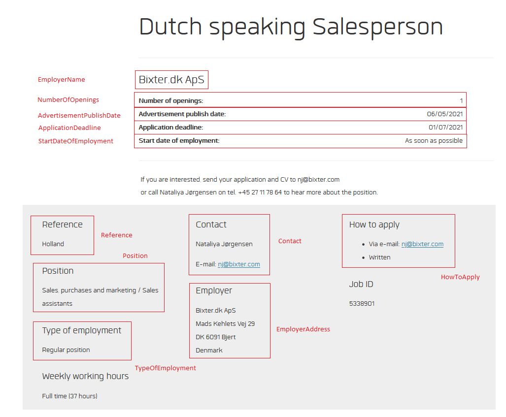

# NW.WIDJobs
Contact: numbworks@gmail.com

## Revision History

| Date | Author | Description |
|---|---|---|
| 2021-05-08 | numbworks | Created. |

## Introduction

`NW.WIDJobs` is a `.NET Standard 2.0` library written in `C#` to explore `WorkInDenmark.dk` and fetch the most recent job ads published. 

## Exploration

The exploration starts from the first page (`https://www.workindenmark.dk/Search/Job-search?q=`), which by default it's sorted by relevance but it can be also sorted by date (`https://www.workindenmark.dk/Search/Job-search?q=&orderBy=date`):


Every page has twenty `PageItems`:


Each `PageItem` provides the preliminary information about the job ad, which are:

- JobId
- Url
- Title
- CreatedOn
- WorkArea
- WorkingHours
- JobType

The `Url` brings us to the a `PageItemExtended`, which represents the job ad with the highest amount of information possible. The amount of informational fields provided by the job ad varies considerably, but in the basic case the `PageItemExtended` will contain the same fields found in the original `PageItem` plus the `Description`:


The following is an example of an `PageItemExtended` containing more fields:




## Example 1: Main Scenario 

Let's ...

```csharp
/*...*/
```

## Markdown Toolset

Suggested toolset to view and edit this Markdown file:

- [Visual Studio Code](https://code.visualstudio.com/)
- [Markdown Preview Enhanced](https://marketplace.visualstudio.com/items?itemName=shd101wyy.markdown-preview-enhanced)
- [Markdown PDF](https://marketplace.visualstudio.com/items?itemName=yzane.markdown-pdf)