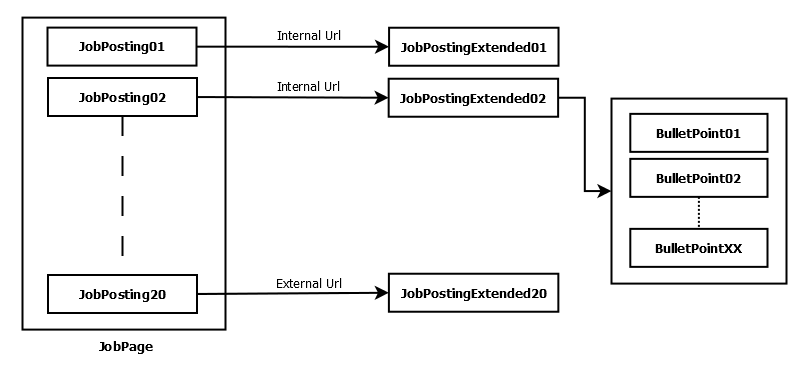

# NW.WIDJobs
Contact: numbworks@gmail.com

## Revision History

| Date | Author | Description |
|---|---|---|
| 2021-05-08 | numbworks | Created. |

## Introduction

`NW.WIDJobs` is a `.NET Standard` library written in `C#` to explore `WorkInDenmark.dk` and fetch the most recent job ads.

## Disclaimer

This software is the outcome of a personal research project about data analysis, data science, modular software packaging and usability in command-line interfaces. At the moment of writing, `WorkInDenmark.dk` doesn't provide a public API and their Terms of Service (ToS) don't state anything against automated data retrieval, but in the future the situation may change. Web scraping may also unnecessarily increase the load of the website if used unwisely. You are warmly adviced to use this software only if you know exactly what you are doing.

## Overview

On the perspective of this library, `WorkInDenmark.dk` is structured as in the following diagram: 


The red boxes highlight the pieces of information we are interested into.

The four objects that have been identified from the diagram above are the following ones:

- `JobPage`
- `JobPosting`
- `JobPostingExtended`
- `BulletPoint`

The relationship between these objects is summarized by the object model below:



Every `JobPage` contains also additional information, such as `TotalResultCount` (the total amount of `JobPostings` on the website in that given moment) and `TotalJobPages`.

The output of every `WorkInDenmark.dk` exploration is collected into an `Exploration` object, which contains more or less items according to the depth of the exploration itself, decided by the user beforehand and described by a `Stage`.

The available `Stages` are the following ones:

|Name|Description|
|---|---|
|`Stage1_OnlyMetrics`|Retrieves the `TotalResultCount` and the `TotalJobPages`. Useful to describe the domain.|
|`Stage2_UpToAllJobPostings`|Retrieves all the items for the previous stage, plus all the `JobPostings`.|
|`Stage3_UpToAllJobPostingsExtended`|Retrieves all the items for the previous stages, plus all the `JobPostingsExtended`.|

The exploration can be delimited by providing a desired value for one of the available thresold criteria:

|Name|Description|
|---|---|
|`FinalPageNumber`|The exploration will go from the first page to this one.|
|`ThresholdDate`|The exploration will continue until `CreatedDate` is greater than `ThresholdDate`.|
|`JobPostingId`|The exploration will continue until `JobPostingId` is not found.|

## Getting started

Now that you know the basics, the first task we might be interested to perform is to describe the domain thru a `Stage1` exploration:

```csharp
using System;
using NW.WIDJobs;
using NW.WIDJobs.Explorations;

/* ... */

WIDExplorer explorer = new WIDExplorer();
Exploration exploration = explorer.Explore(1, Stages.Stage1_OnlyMetrics);
Console.WriteLine(exploration);
```

These few lines of code will output a log that includes `TotalResultCount` and `TotalJobPages`:

```
...
[2021-09-03 11:27:34:436] TotalResultCount:'2476'.
[2021-09-03 11:27:34:437] TotalJobPages:'124'.
...
```

Once you got a preliminary idea of the domain, you can decide until which page number you want to explore. Let's say we want to explore only the first page, but fetch the maximum amount of data (`Stage3`):

```csharp
/* ... */

WIDExplorer explorer = new WIDExplorer();
Exploration exploration = explorer.Explore(1, Stages.Stage3_UpToAllJobPostingsExtended);
Console.WriteLine(exploration);
```

These few lines of code will output a log that includes a textual summarization of the `Exploration` object:

```
...
[2021-09-03 15:47:26:811] An anti-flooding strategy based on the provided settings is now in use.
[2021-09-03 15:47:26:812] ParallelRequests:'3'.
[2021-09-03 15:47:26:812] PauseBetweenRequestsMs:'25000'.
[2021-09-03 15:47:26:812] '20' 'JobPosting' objects have been scraped in total.
[2021-09-03 15:47:26:813] The execution of the 'Stage3_UpToAllJobPostingsExtended' has been started.
[2021-09-03 15:47:27:348] JobPage '1', PageItem '1' - A 'JobPostingExtended' object has been scraped.
[2021-09-03 15:47:27:617] JobPage '1', PageItem '2' - A 'JobPostingExtended' object has been scraped.
[2021-09-03 15:47:27:879] JobPage '1', PageItem '3' - A 'JobPostingExtended' object has been scraped.
...
[2021-09-03 15:50:02:498] JobPage '1', PageItem '20' - A 'JobPostingExtended' object has been scraped.
[2021-09-03 15:50:02:499] '20' 'JobPostingExtended' objects have been scraped in total.
[2021-09-03 15:50:02:499] The exploration has been completed.
{ 'RunId':'ID:20210903174724286|FROM:1|TO:1', 'TotalResultCount':'2496', 'TotalJobPages':'125', 'Stage':'Stage3_UpToAllJobPostingsExtended', 'IsCompleted':'True', 'JobPages':'1', 'JobPostings':'20', 'JobPostingsExtended':'20' }
...
```


...

# The URLs

The exploration of `WorkInDenmark.dk` starts from an landing page and then it continues for x subsequent pages. 

The page URLs have a different schema according to a given criteria:

|Type|Criteria|Page|Url|
|---|---|---|---|
|Search|`Default`|1|`https://job.jobnet.dk/CV/FindWork?Offset=0&SortValue=BestMatch&widk=true`|
|...|...|...|...|
|Search|`OrderByCreationDate`|1|`https://job.jobnet.dk/CV/FindWork?Offset=0&SortValue=CreationDate&widk=true`|
|Search|`OrderByCreationDate`|2|`https://job.jobnet.dk/CV/FindWork?Offset=20&SortValue=CreationDate&widk=true`|
|...|...|...|...|

But for the scope of this library we do use the generic page URL:

|Type|Url|
|---|---|
|Search|`https://job.jobnet.dk/CV/FindWork/SearchWIDK`|

The detail pages for each job have the following URLs instead:

|Type|Criteria|Url|
|---|---|---|
|JobDetails|`Standard`|`https://job.jobnet.dk/CV/FindWork/JobDetailJsonWIDK?id={ID}`|
|JobDetails|`PreviewToken`|`https://job.jobnet.dk/CV/FindWork/JobDetailJsonWIDK?id={ID}&previewtoken=`|
|JobDetails|`Alternative`|`https://job.jobnet.dk/CV/FindWork/DetailsWidk/{ID}`|

For the scope of this library we do use the the `Standard` variant.

## The API endpoints

`WorkInDenmark.dk` relies upon an internal API, which has the following endpoints:

|Endpoint|Description|
|---|---|
|`GetJobPage()`|Returns a certain `JobPage`, which corresponds to twenty `JobPostings` (or less, if it's the last one).|
|`GetJobPostingExtended()`|Returns a certain `JobPageExtended`.|

Side note: the names of the API endpoints are arbitrary and adapted to our object model to maximize understanding.

## GetJobPage - The endpoint

**Request:**

|Method|Url|Authentication|Headers|Body|
|---|---|---|---|---|
|`POST`|`https://job.jobnet.dk/CV/FindWork/SearchWIDK`|No|Optional|Yes|

**Headers:**

|Type|Name|Value|
|---|---|---|
|Optional|User Agent|`Mozilla/5.0 (Windows NT 10.0; Win64; x64; rv:91.0) Gecko/20100101 Firefox/91.0`|

**Body:**

This example retrieves the first `JobPage` (which equals to the first twenty `JobPostings`) sorted by `CreationDate`:

```json
{
    "model": {
        "Offset": "0",
        "Count": 20,
        "SearchString": "",
        "SortValue": "CreationDate",
        "Id": [],
        "EarliestPublicationDate": null,
        "HotJob": null,
        "Abroad": null,
        "NearBy": "",
        "OnlyGeoPoints": false,
        "WorkPlaceNotStatic": null,
        "WorkHourMin": null,
        "WorkHourMax": null,
        "Facets": {
            "Region": null,
            "Country": null,
            "Municipality": null,
            "PostalCode": null,
            "OccupationAreas": null,
            "OccupationGroups": null,
            "Occupations": null,
            "EmploymentType": null,
            "WorkHours": null,
            "WorkHourPartTime": null,
            "JobAnnouncementType": null,
            "WorkPlaceNotStatic": null
        },
        "LocatedIn": null,
        "LocationZip": null,
        "Location": null,
        "SearchInGeoDistance": 0
    },
    "url": "/CV/FindWork?Offset=0&SortValue=CreationDate&widk=true"
}
```

The `url` field in the `Body` changes according to the following schema:

|Page|Offset|Url|
|---|---|---|
|1|0|`https://job.jobnet.dk/CV/FindWork?Offset=0&SortValue=CreationDate&widk=true`|
|2|20|`https://job.jobnet.dk/CV/FindWork?Offset=20&SortValue=CreationDate&widk=true`|
|...|...|...|

The `Offset` field identifies the starting point and can only be 0 or a number that can be divided by 20.

The `Count` field accepts only `20` as value. You can change it to whatever value you want, but it will return 20 job postings anyway.

**Response:**

```json
{
    "Expression": {
        ...
    },
    "Facets": {
        ...
    },
    "JobPositionPostings": [
        {
            "AutomatchType": 0,
            "Abroad": false,
            "Weight": 1.0,
            "Title": "Demolition",
            "JobHeadline": "Demolition",
            "Presentation": "<p>Xterna is looking for unskilled workers for a demolition project in Denmark. The work is situated in the weekend.</p>\n",
            "HiringOrgName": "Xterna A/S",
            "WorkPlaceAddress": "Fabriksparken 13",
            "WorkPlacePostalCode": "9230",
            "WorkPlaceCity": "Svenstrup J",
            "WorkPlaceOtherAddress": false,
            "WorkPlaceAbroad": false,
            "WorkPlaceNotStatic": false,
            "UseWorkPlaceAddressForJoblog": true,
            "PostingCreated": "2021-06-22T00:00:00",
            "LastDateApplication": "2021-06-25T00:00:00",
            "FormattedLastDateApplication": "25. juni 2021",
            "AssignmentStartDate": "0001-01-01T00:00:00",
            "IsHotjob": false,
            "IsExternal": false,
            "Url": "https://job.jobnet.dk/CV/FindWork/Details/5374939",
            "Region": "Nordjylland",
            "Municipality": "Aalborg",
            "Country": "Danmark",
            "PostalCode": "9230",
            "PostalCodeName": null,
            "JobAnnouncementType": "",
            "EmploymentType": "",
            "WorkHours": "Deltid",
            "OccupationArea": "",
            "OccupationGroup": "",
            "Occupation": "Specialarbejder, byggeri",
            "Location": {
                "Latitude": 56.9811,
                "Longitude": 9.8538
            },
            "JoblogWorkTime": {
                "WorkHour": "(34 - 36 timer ugentligt)",
                "DailyWorkTime": "Aften, nat, weekend"
            },
            "WorkplaceID": 119356,
            "OrganisationId": "105966",
            "HiringOrgCVR": 37800902,
            "UserLoggedIn": false,
            "AnonymousEmployer": false,
            "ShareUrl": "https://job.jobnet.dk/CV/FindWork/DetailsSocialmedia/5374939",
            "DetailsUrl": "https://job.jobnet.dk/CV/FindWork/Details/5374939",
            "JobLogUrl": "https://job.jobnet.dk/CV/FindWork/Details/5374939",
            "HasLocationValues": true,
            "ID": "5374939",
            "Latitude": 56.9811,
            "Longitude": 9.8538
        },
        ...       
        {
            ...
            "IsExternal": true,
            "Url": "https://jobs.danfoss.com/job/Nordborg-Ufaglærte-produktionsmedarbejdere-til-maleområde/730219002/",
            ...
            "ID": "E8232793",
            ...
        },
    ...
    ],
    "TotalResultCount": 2265
}
```
## GetJobPage - The TotalResultCount value 

|Type|Field|ExampleValue|Action|
|---|---|---|---|
|`Mandatory`|`TotalResultCount`|2265|Parse to `uint16`.|

## GetJobPage - The JobPage object

The following fields will be extracted from the response:

|Type|Field|Description|
|---|---|---|
|`Mandatory`|`Response`|In JSON format.|

The following fields are provided or derivative:

|Type|Field|Description|
|---|---|---|
|`Mandatory`|`RunId`||
|`Mandatory`|`PageNumber`||

## GetJobPage - The JobPosting object

The following fields will be extracted from the response:

|Type|Field|ExampleValue|
|---|---|---|
|`Mandatory`|`Response`|In JSON format.|
|`Mandatory`|`Title`|"Demolition"|
|`Optional`|`Presentation`|"Xterna is looking for..."|
|`Mandatory`|`HiringOrgName`|"Xterna A/S"|
|`Optional`|`WorkPlaceAddress`|"Fabriksparken 13" or ""|
|`Optional`|`WorkPlacePostalCode`|"9230"|
|`Optional`|`WorkPlaceCity`|"Svenstrup J"|
|`Mandatory`|`PostingCreated`|"2021-06-22T00:00:00"|
|`Mandatory`|`LastDateApplication`|"2021-06-25T00:00:00"|
|`Mandatory`|`Url`|"https://job.jobnet.dk/CV/FindWork/Details/5374939" or "https://jobs.danfoss.com/job//730219002/"|
|`Optional`|`Region`|"Nordjylland"|
|`Optional`|`Municipality`|"Aalborg"|
|`Optional`|`Country`|"Danmark"|
|`Optional`|`EmploymentType`|"Fastansættelse" or ""|
|`Mandatory`|`WorkHours`|"Fuldtid" or "Deltid"|
|`Optional`|`Occupation`|"Specialist, construction"|
|`Mandatory`|`WorkplaceID`|119356|
|`Optional`|`OrganisationId`|"105966"|
|`Mandatory`|`HiringOrgCVR`|37800902|
|`Mandatory`|`ID`|"5374939" or "E8232793"|Remove "E" when needed and parse to integer.|

The following fields are derivative:

|Field|Description|
|---|---|
|`WorkPlaceCityWithoutZone`|`WorkPlaceCity` without zone or `WorkPlaceCity`.|
|`JobPostingNumber`|Equals to the item's position in the list starting from 1.|
|`JobPostingId`|`ID` and `Title` combined. If `Title` is longer than five words, only the first five words are used.|
|`Language`|Predicted by using a custom training set and the [NW.NGramTextClassification](https://github.com/numbworks/NW.NGramTextClassification) library. This is derived from a machine learning-powered feature, which may be moderately expensive on the CPU.|

The following fields require extra processing:

|Field|Action|
|---|---|
|`WorkPlacePostalCode`|Parse it to `uint16` or `null`.|
|`PostingCreated`|Parse it to `DateTime`.|
|`LastDateApplication`|Parse it to `DateTime`.|
|`Occupation`|This can be optionally translated from Danish to English via `OccupationTranslator`.|
|`WorkplaceID`|Parse it to `uint64`.|
|`OrganisationId`|Parse it to `uint64` or `null`.|
|`HiringOrgCVR`|Parse it to `uint64`.|
|`ID`|Remove "E" (when required) and parse it to `uint64`.|

The `WorkPlaceCityWithoutZone` field is required, because in many cases `WorkPlaceCity` comes with the "zone" suffix by default, which could limit further data processing activities on the `JobPosting` objects such as grouping. Here some of the most common cases:

|WorkPlaceCity|WorkPlaceCityWithoutZone|
|---|---|
|København K|København|
|Kgs. Lyngby|Kgs. Lyngby|
|København V|København|
|København Ø|København|
|København S|København|
|Aarhus C|Aarhus|
|Viby J|Viby|
|Odense S|Odense|
|Kongens Lyngby|Kongens Lyngby|
|Billund|Billund|
|København SV|København|
|Esbjerg V|Esbjerg|
|Odense SØ|Odense|
|Lem St|Lem|

## GetJobPostingExtended - The endpoint

**Request:**

|Method|Url|Authentication|Headers| Body|
|---|---|---|---|---|
|`GET`|`https://job.jobnet.dk/CV/FindWork/JobDetailJsonWIDK?id={ID}`|No|Optional| No|

**Headers:**

|Type|Name|Value|
|---|---|---|
|Optional|User Agent|`Mozilla/5.0 (Windows NT 10.0; Win64; x64; rv:91.0) Gecko/20100101 Firefox/91.0`|

**Response:**

```json
{
    ...
    "JobPositionPosting": {
        ...
        "HiringOrg": {
            ...
            "Description": "Xterna har profiler indenfor flere fagområder. Det er vigtigt for Xterna, at vores kunder får de medarbejdere, der har de bedste kvalifikationer til lige netop den opgave, der søges løst. \nVi har bemanding inden for, og rekrutterer kvalificeret arbejdskraft til, bygge-, anlæg og industr",
            ...
        },
        ...
        "PublicationStartDate": "2021-06-22T00:00:00",
        "PublicationEndDate": "2021-06-25T00:00:00",
        "JobPositionInformation": {
            ...
            "Purpose": "<p>Xterna is looking for unskilled workers for a demolition project in Denmark. The work is situated in the weekend.</p>\n<p>If you have&nbsp;experience with light weight handtools and working in conctruction, then this job for you. You are going to be a part of a large, well-established company.</p>\n<p>Start-up the 16.07.21.</p>\n<p><strong>Tasks:</strong></p>\n<p>Hard physical labor&nbsp;for decomposition of buildings.</p>\n<p><strong>Qualifications: </strong></p>\n<p>- Used to work on building site</p>\n<p>- Used to use handtools</p>\n<p>- You have a great commitment and can take responsibility</p>\n<p>- You are conscientious with good collaboration skills</p>\n<p><strong>You as a person: </strong></p>\n<p>You are a positive fire soul with an energy that spreads to the tasks and people around you. You work proactively and see opportunities rather than limitations. You also work independently with a good overview and take great ownership of your tasks. You possess good communication skills and work team-oriented. You are also quality-conscious and emphasize orderliness in the execution of your work. You are structured and know how to prioritize your tasks according to set goals.</p>\n<p><strong>We offer:</strong></p>\n<p>In addition to orderly pay and working conditions, where you receive the same salary and terms as the company's own employees, you also get the opportunity to join one of our attractive employee schemes. We want to attract the best candidates and offer several different attractive add-on and bonus programs.</p>\n<p><strong>Application: </strong></p>\n<p>To apply for this position, send your application and your CV to ansoegning@xterna.dk and mark it with \"Electrician - Aarhus North\" Applications are processed on an ongoing basis - and the positions may be filled before expiration. If you have further questions, you are welcome to contact us on tel .: 72 301 302</p>",
            ...
            "NumberToFill": 10,
            ...
            "JppContacts": [
                {
                    ...
                    "Email": "cf@xterna.dk",
                    ...
                    "PersonName": "Christian Frydenlund",
                    ...
                }
            ],
            "EmploymentDate": "2021-07-16T00:00:00"
        },
        ...
        "ApplicationDetails": {
            ...
            "ApplicationDeadlineDate": "2021-06-25T00:00:00"
        },
        ...
    },
    ...
}
```

## GetJobPostingExtended - The JobPostingExtended object

The following fields will be extracted from the response:

|Type|Field|ExampleValue|
|---|---|---|
|`Mandatory`|`Response`|In JSON format (when internal URL) or in HTML format (when external URL).|
|`Optional`|`HiringOrgDescription`|"Xterna har profiler indenfor..."|
|`Optional`|`PublicationStartDate`|"2021-06-22T00:00:00"|
|`Optional`|`PublicationEndDate`|"2021-06-25T00:00:00"|
|`Optional`|`Purpose`|"Xterna is looking for..."|
|`Optional`|`NumberToFill`|10|
|`Optional`|`ContactEmail`|"cf@xterna.dk"|
|`Optional`|`ContactPersonName`|"Christian Frydenlund"|
|`Optional`|`EmploymentDate`|"2021-07-16T00:00:00"|
|`Optional`|`ApplicationDeadlineDate`|"2021-06-25T00:00:00"|

The following fields are derivative:

|Field|Description|
|---|---|
|`BulletPoints`|If the `Response` is in JSON format, these are tentatively extracted from the `Purpose` field. If the `Response` is in HTML format instead, the `Response` itself is used.|
|`BulletPointScenario`|A label that specifies how the `BulletPoints` have been extracted.|

The following fields require extra processing:

|Field|Action|
|---|---|
|`PublicationStartDate`|Parse it to `DateTime` or `null`.|
|`PublicationEndDate`|Parse it to `DateTime` or `null`.|
|`Purpose`|Run it thru Html decoding.|
|`NumberToFill`|Parse it to `uint16` or `null`.|
|`EmploymentDate`|Parse it to `DateTime` or `null`.|
|`ApplicationDeadlineDate`|Parse it to `DateTime` or `null`.|

## GetJobPostingExtended - Extracting Bullet Points via XPath

This approach works on both `Purpose` (internal URLs) and `Response` (external URLs). 

Considering that the external URLs could have endless different layouts, we do provide one XPath pattern for each of the most recurrent scenarios:

|#|Scenario|Pattern|
|---|---|---|
|1|novonordisk|`//ul/li/span/span/span/span`|

```html
...
<p>
  <span>
    <span>
      <span>
        <b>
          <span>Qualifications</span></b></span></span></span></p>
<ul>
  <li>
    <span>
      <span>
        <span>
          <span>The most important in this job is your personality. We
            weigh discretion highly and the importance of our customers
            getting a professional service when they are welcomed by you
            at our receptions.</span></span></span></span></li>
...
```

|#|Scenario|Pattern|
|---|---|---|
|2|jobportal|`//div[@class='vacancy_details_area']/ul/li`|

```html
...
    <div class="vacancy_details_area">
	...
<ul>
	<li>Field-based ecosystem manipulations experiments and monitoring of greenhouse gas production</li>
	<li>Measurements of subsurface and snow gas concentrations, diffusion and greenhouse gas fluxes</li>
	<li>Process-based models to simulate changes in climate-soil-plant-microbial characteristics</li>
	<li>Structural equation modelling</li>
</ul>	
...
```

|#|Scenario|Pattern|
|---|---|---|
|3|easycruit|`//div[@class='jd-description']/ul/li`|

```html
...
<div class="jd-description">
			...
			<ul><li>Subject matter expert with responsibility for planning, advising on, coordinating, and handling public disclosure of clinical trial information.</li>
			...
...
```

|#|Scenario|Pattern|
|---|---|---|
|4|coloplast|`//span[@class='jobdescription']/ul/li`|

```html
...
<span class="jobdescription">
...
	<ul>
		<li>Set a clear direction for sales capabilities within the Consumer channel, ensure that we have the right toolbox in place for in- and outbound calls and that these align with HQ requirements</li>
		<li>Ensure that we locally have the tools necessary to give our customers get the highest level of quality in terms of service and sales </li>
		<li>Work with stakeholders to identify training needs and opportunities and determine what areas should be included in training modules </li>
		<li>Motivate and develop consumer care managers </li>
	</ul>
...
```

|#|Scenario|Pattern|
|---|---|---|
|5|randstad|`//p[starts-with(., '-') and .//br]/text()`|

```html
...
<p>- Picking/packing tasks<br />- Loading/unloading tasks<br />- Receipt of goods<br />-
    Truck driving, most often reach truck<br />- Scanner operation<br />- Various warehouse tasks<br /><br />
...
```

|#|Scenario|Pattern|
|---|---|---|
|6|keepit|`//p[starts-with(., '-')]`|

```html
...
\n<p><strong>The types of technical challenges that you will be solving with your team could
        be:</strong></p>\n<p>-       Performance troubleshooting - if a service is not performing as expected,
    troubleshooting the process interactions on a live server in order to identify the root cause and propose a remedy,
    possibly in collaboration with the development team.</p>\n<p>-       Planning, testing, and executing Postgres
    database cluster migration from an older version to a newer version with little or no user-visible interruptions.
</p>\n<p>-       Designing the next iteration ...
...
```

As last resort, a generic one is also available:

|#|Scenario|Pattern|
|---|---|---|
|7|generic|`//ul/li|//ol/li`|

## GetJobPostingExtended - Extracting Bullet Points via regex

This is mainly intended for the `Purpose` field:

|Pattern|Description|
|---|---|
|`(?<=-\\t)[\w ]{1,}(?=-\\t)`|The latest bullet point migth lost.|

## GetJobPostingExtended - Cleaning extracted Bullet Points

The following self-explanatory cleaning actions are applied on the extracted bullet points:

|Field|Action|
|---|---|
|`BulletPoints`|`RemoveNewLines()`.|
|`BulletPoints`|`RemoveExtraWhiteSpaces()`.|
|`BulletPoints`|`RemoveInitialHyphen()`.|
|`BulletPoints`|`FixNonBreakingSpaceCharacters()`.|

## JobPostingManager - The logic behind IsThresholdConditionMet()

During an exploration and while evaluating the content of a `Page`, the `JobPostingManager.IsThresholdConditionMet()` method establishes if the `ThresholdDate` condition is met and the exploration should stop (`true` case), or if the exploration should continue (`false` case).

Since the logic is a not immediate to understand, I'll show how it works by using an example.

Given the the following `ThresholdDate` and `PostingCreatedCollection`, we can see which kind of case we are in on the rightmost column:

|ThresholdDate|
|---|
|2021-04-28|

|PostingCreated|DateType|Threshold|
|---|---|---|
|||Case 1|
|2021-05-07|MostRecent|Case 2|
|2021-05-07||Case 2|
|2021-05-07||Case 2|
|2021-05-05||Case 2|
|2021-05-05||Case 2|
|2021-05-05||Case 2|
|2021-05-05||Case 2|
|2021-05-01||Case 2|
|2021-05-01||Case 2|
|2021-05-01||Case 2|
|2021-04-30||Case 2|
|2021-04-30||Case 2|
|2021-04-30||Case 2|
|2021-04-30||Case 2|
|2021-04-30||Case 2|
|2021-04-30||Case 2|
|2021-04-28||Case 3|
|2021-04-28||Case 3|
|2021-04-28||Case 3|
|2021-04-28|LeastRecent|Case 3|
|||Case 4|

The case numbers above correspond to the following conditions and to the following `IsThresholdConditionMet()` returns:

|Threshold|Condition|Return|
|---|---|---|
|Case 1|ThresholdDate > MostRecent|False|
|Case 2|ThresholdDate > LeastRecent && ThresholdDate <= MostRecent|True|
|Case 3|ThresholdDate == LeastRecent|False|
|Case 4|ThresholdDate < LeastRecent|False|

`Case 3` and `Case 3` are `False` because the next `Page` could contain other `PageItem` objects with the same date, therefore the exploration should continue.

## JobPostingManager - The logic behind RemoveUnsuitable()

If the `JobPostingManager.IsThresholdConditionMet()` method returns `True` for a given `JobPosting`, the exploration must stop and the unsuitable `JobPosting` objects must be removed.

The `RemoveUnsuitable()` method is intended for the purpose above, and it works using the following logic:

|ThresholdDate|
|---|
|2021-04-28|

|PostingCreated|Action|
|---|---|---|
|2021-05-07|Keep|
|2021-05-07|Keep|
|2021-05-07|Keep|
|2021-05-05|Keep|
|2021-05-05|Keep|
|2021-05-05|Keep|
|2021-05-05|Keep|
|2021-05-01|Keep|
|2021-05-01|Keep|
|2021-05-01|Keep|
|2021-04-30|Keep|
|2021-04-30|Keep|
|2021-04-30|Keep|
|2021-04-30|Keep|
|2021-04-30|Keep|
|2021-04-30|Keep|
|2021-04-28|Remove|
|2021-04-28|Remove|
|2021-04-28|Remove|
|2021-04-28|Remove|

As alternative, `JobPostingId` can be used as criteria instead of `ThresholdDate`.

Given the the following `JobPostingId` and `JobPostings`, we can see which kind of case we are in on the rightmost column and act accordingly.

|TargetJobPostingId|
|---|
|8144090studentworker|

|PostingCreated|JobPostingId|Case|
|---|---|---|---|
|2021-05-07|8144115learningsalesfulltimestudentposition|Case 1|
|2021-05-07|8144114unpaidinternshipsales|Case 1|
|2021-05-07|8144099sitereliabilityengineer|Case 1|
|2021-05-05|8144098itarchitectconsultant|Case 1|
|2021-05-05|8144090studentworker|Case 2|
|2021-05-05|8144089businesssupportpricingmanager|||
|...|...|...|...|

The case numbers above correspond to the following conditions and actions:

|Case|Condition|Action|
|---|---|---|
|Case 1|(JobPostingId == TargetJobPostingId) == False|Add to a new List and Continue|
|Case 2|(JobPostingId == TargetJobPostingId) == True|Break Loop|

The new list will basically contain only `Case 1` items.

## WIDExplorer - Explore by FinalPageNumber

In order to avoid to call the server even one time more than needed, the exploration is performed in subsequent phases called `Stages`. 

The standard scenario is the exploration by `FinalPageNumber`, which works like below:

**Stage1**:

|Type|Field|Result|
|---|---|---|
|Input|RunId|Value|
|Input|InitialPageNumber|1|
|Input|FinalPageNumber|x|
|Input|Stage|Stage1 OR Stage2 OR Stage3|
||||
|Output|RunId|=|
|Output|TotalResultCount|Value|
|Output|TotalJobPages|Value|
|Output|Stage|Stage1 OR Stage2 OR Stage3|
|Output|IsCompleted|True OR False|
|Output|JobPages|1 JobPages|
|Output|JobPostings|Null|
|Output|JobPostingsExtended|Null|

**EstablishFinalPageNumber**:

|Type|Field|Result|
|---|---|---|
|Input|FinalPageNumber|Value|
|Input|TotalJobPages|Value|
||||
|Output|FinalPageNumber|Value|

**Stage 2**:

|Type|Field|Result|
|---|---|---|
|Input|Exploration|Value|
|Input|FinalPageNumber|x|
|Input|Stage|Stage2 OR Stage3|
||||
|Output|RunId|=|
|Output|TotalResultCount|=|
|Output|TotalJobPages|=|
|Output|Stage|Stage2 OR Stage3|
|Output|IsCompleted|True OR False|
|Output|JobPages|x JobPages|
|Output|JobPostings|(x * 20) JobPostings|
|Output|JobPostingsExtended|Null|

**Stage 3**:

|Type|Field|Result|
|---|---|---|
|Input|Exploration|Value|
|Input|Stage|Stage3|
||||
|Output|RunId|=|
|Output|TotalResultCount|=|
|Output|TotalJobPages|=|
|Output|Category|=|
|Output|Stage|Stage3|
|Output|IsCompleted|True|
|Output|JobPages|=|
|Output|JobPostings|=|
|Output|JobPostingsExtended|(x * 20) JobPostingsExtended|

## WIDExplorer - Explore by ThresholdDate

The "commodity" scenario is the exploration by `ThresholdDate`. 

The only difference with the standard one is that there is no `FinalPageNumber`, therefore the library has to evaluate each  `JobPage` from `PageNumber` 1 to  `TotalJobPages` until the threshold condition is met. 

Please give a look to the "flow" below (only the difference with the standard scenario is shown):

**Stage 1**:

|Type|Field|Result|
|---|---|---|
|...|...|...|
|Input|FinalPageNumber|**?**|
|...|...|...|
||||
|...|...|...|

**Stage 2**:

|Type|Field|Result|
|---|---|---|
|...|...|...|
|Input|**ThresholdDate**|VALUE|
|...|...|...|
||||
|...|...|...|
|Output|JobPages|**x JobPages until threshold condtion is met**|
|Output|JobPostings|**(x * 20 * JobPages) - y JobPostings not meeting the condition**|
|...|...|...|

**Stage 3**:

|Type|Field|Result|
|---|---|---|
|...|...|...|

## WIDExplorer - Pre-Labeled Examples

Given the the following `BulletPointLabels`:

|BulletPointLabels|
|---|
|JobDuty|
|JobRequirement|
|JobTechnology|
|JobBenefit|
|...|

the `WIDExplorer.GetPreLabeledExamples()` method will return a pre-defined list of already-labeled `BulletPoint` objects which looks like:

|Label|Text|
|---|---|
|JobDuty|Flexible working hours are occasionally required|
|JobDuty|Create Interfaces to FPGA|
|JobRequirement|Engineering degree within acoustics & vibration|
|JobRequirement|Mechatronic experience is an advantage|
|JobTechnology|Good level with MS Office package|
|JobTechnology|Have a min 8/10experience with Photoshop|
|JobBenefit|Competitive salary, plus share/stock options.|
|JobBenefit|Excellent growth opportunities.|
|...|...|

This list can be fed into a categorization library (such as [NW.NGramTextClassification](https://github.com/numbworks/NW.NGramTextClassification)) and train it to correctly label new bullet point texts automatically.

## The data model

`WIDExplorer` allows to export data into a SQLite database thru the `ToSQLite()` method. 

The data model of this database is the following one:


## Appendix - The TotalResultCount value via XPath

```html
...
<span data-ng-show="resultCount >= 0" aria-live="polite" class="ng-binding" aria-hidden="false" style="">2265 Job postings<span class="sr-only">&nbsp;matches your search criteria</span></span>
...
```

|Type|Field|Pattern|
|---|---|---|
|`Mandatory`|`TotalJobPostings`|`//*[@id="ResultToolbar"]/div[1]/h2/span[1]/text()'|

|Field|Action|
|---|---|
|`TotalJobPostings`|Requires removal of " Job postings".|

## Markdown Toolset

Suggested toolset to view and edit this Markdown file:

- [Visual Studio Code](https://code.visualstudio.com/)
- [Markdown Preview Enhanced](https://marketplace.visualstudio.com/items?itemName=shd101wyy.markdown-preview-enhanced)
- [Markdown PDF](https://marketplace.visualstudio.com/items?itemName=yzane.markdown-pdf)