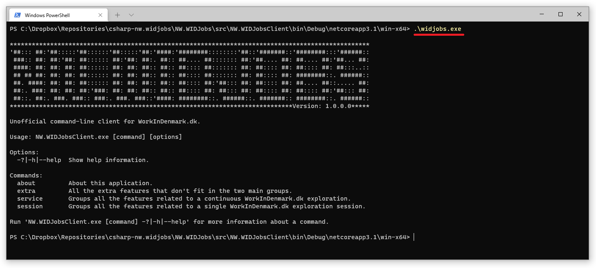
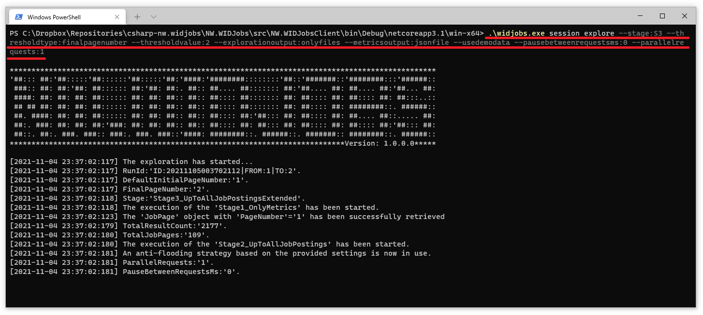
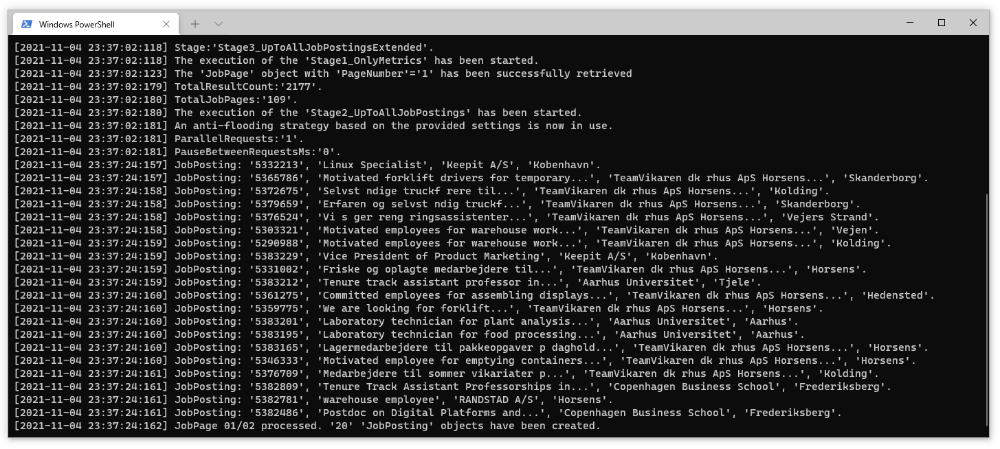
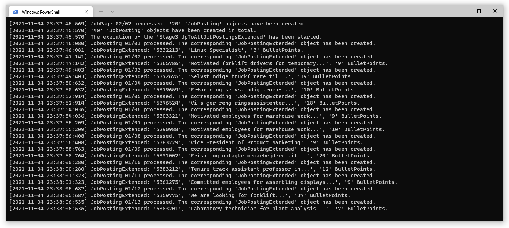
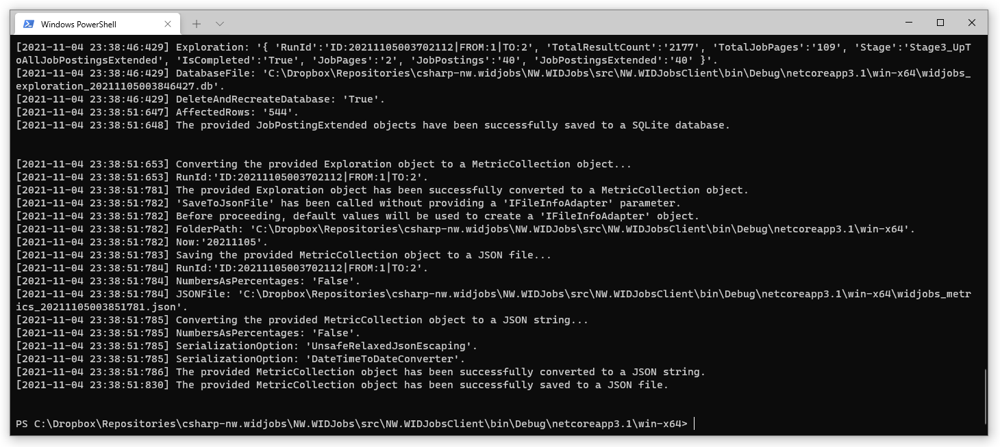
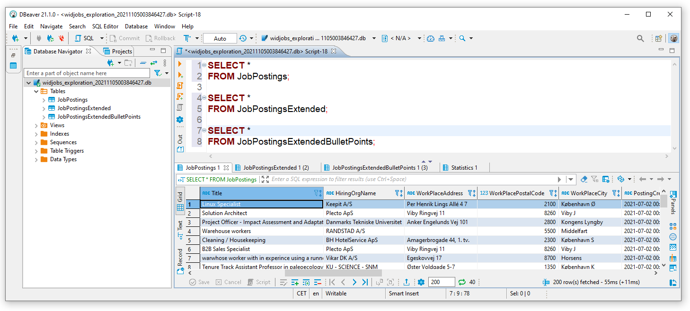
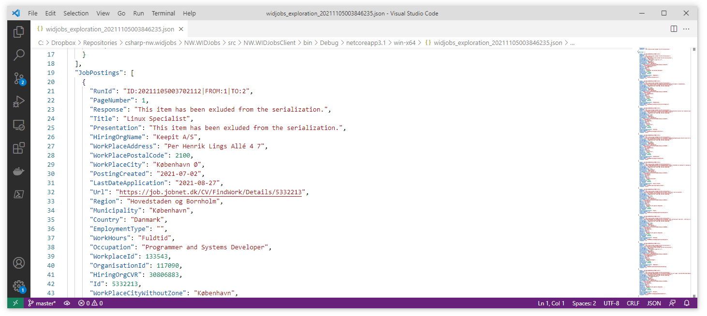
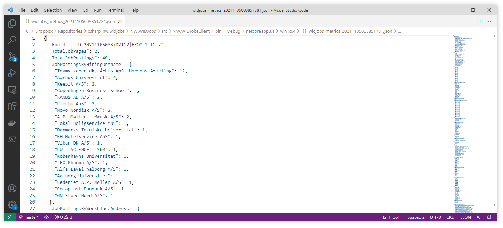

# NW.WIDJobsClient
Contact: numbworks@gmail.com

## Revision History

| Date | Author | Description |
|---|---|---|
| 2021-05-08 | numbworks | Created. |

## Introduction

`NW.WIDJobsClient` (`widjobs.exe`) is an unofficial command-line client for `WorkInDenmark.dk`, based on the `NW.WIDJobs` library and written in in C# (`.NET Core`).

## Disclaimer

This software is the outcome of a personal research project about data analysis, data science, modular software packaging and usability in command-line interfaces. At the moment of writing, `WorkInDenmark.dk` doesn't provide a public API and their Terms of Service (ToS) don't state anything against automated data retrieval, but in the future the situation may change. Web scraping may also unnecessarily increase the load of the website if used unwisely. You are warmly adviced to use this software only if you know exactly what you are doing.

## Screenshots










## Overview

The command-line interface for `NW.WIDJobsClient` is summarized by the following table:

|Command|Sub Command|Options|Exit Codes|
|---|---|---|---|
|about|||Success|
|session|||Success|
|session|calculate|--jsonpath:{path}<br />--output:{jsonfile\|console\|both}<br />*--folderpath:{path}*<br />*--aspercentages*|Success<br />Failure|
|session|convert|--jsonpath:{path}<br />--output:{databasefile}<br />*--folderpath:{path}*|Success<br />Failure|
|session|describe|--output:{jsonfile\|console\|both}<br />*--folderpath:{path}*<br />*--verboseserialization*<br />*--usedemodata*|Success<br />Failure|
|session|explore|--stage:{S2\|S3}<br />--thresholdtype:{finalpagenumber\|thresholddate\|jobpostingid}<br />--thresholdvalue:{finalpagenumber}\|{thresholddate}\|{jobpostingid}<br />--explorationoutput:{databasefile\|jsonfile\|console\|onlyfiles\|all}<br />*--folderpath:{path}*<br />*--verboseserialization*<br />*--metricsoutput:{jsonfile\|console\|both\|none}*<br />*--aspercentages*<br />*--parallelrequests:{number}*<br />*--pausebetweenrequestsms:{number}*<br />*--usedemodata*|Success<br />Failure|
|service|||Success|
|service|explore|<font color="red">Not available yet.</font>|Success<br />Failure|
|extra|||Success|
|extra|prelabeledbulletpoints|--output:{jsonfile\|console\|both}<br />*--folderpath:{path}*|Success<br />Failure|

The regular font indicates the mandatory options, while the *italic*  font indicates an optional ones.

The exit codes are summarized below:

|Label|Value|
|---|---|
|Success|0|
|Failure|1|

## Getting started

Once you have downloaded the application, open a command prompt (such as Windows Terminal) and navigate to the application folder.

The following commands will provide information about each `Command`, `Sub Command` and `Option`:

```powershell
PS C:\widjobs>.\widjobs.exe
PS C:\widjobs>.\widjobs.exe session
PS C:\widjobs>.\widjobs.exe session calculate --help
PS C:\widjobs>.\widjobs.exe session convert --help
PS C:\widjobs>.\widjobs.exe session describe --help
PS C:\widjobs>.\widjobs.exe session explore --help
PS C:\widjobs>.\widjobs.exe service
PS C:\widjobs>.\widjobs.exe extra
PS C:\widjobs>.\widjobs.exe extra prelabeledbulletpoints --help
```

The following command will provide some essential information about the application itself:

```powershell
PS C:\widjobs>.\widjobs.exe about
```

The following command will:

- take a previously saved exploration (in JSON format) as input;
- calculate a bunch of metrics out of it
- save it to a JSON file in the application's folder

```powershell
PS C:\widjobs>.\widjobs.exe session calculate --jsonpath:"C:\widjobs_exploration_20210904205304333.json" --output:jsonfile
```

An exploration file looks like this:

```json
{
  "RunId": "ID:20210904221249647|FROM:1|TO:1",
  "TotalResultCount": 2177,
  "TotalJobPages": 109,
  "Stage": "Stage3_UpToAllJobPostingsExtended",
  "IsCompleted": true,
  "JobPages": [
    {
      "RunId": "ID:20210904221249647|FROM:1|TO:1",
      "PageNumber": 1,
      "Response": "This item has been exluded from the serialization."
    }
  ],
  "JobPostings": [
    {
      "RunId": "ID:20210904221249647|FROM:1|TO:1",
      "PageNumber": 1,
      "Response": "This item has been exluded from the serialization.",
      "Title": "Linux Specialist",
      "Presentation": "This item has been exluded from the serialization.",
      "HiringOrgName": "Keepit A/S",
      "WorkPlaceAddress": "Per Henrik Lings Allé 4 7",
      "WorkPlacePostalCode": 2100,
      "WorkPlaceCity": "København Ø",
      "PostingCreated": "2021-07-02",
      "LastDateApplication": "2021-08-27",
      "Url": "https://job.jobnet.dk/CV/FindWork/Details/5332213",
      "Region": "Hovedstaden og Bornholm",
      "Municipality": "København",
      "Country": "Danmark",
      "EmploymentType": "",
      "WorkHours": "Fuldtid",
      "Occupation": "Programmør og systemudvikler",
      "WorkplaceId": 133543,
      "OrganisationId": 117090,
      "HiringOrgCVR": 30806883,
      "Id": 5332213,
      "WorkPlaceCityWithoutZone": "København",
      "JobPostingNumber": 1,
      "JobPostingId": "5332213linuxspecialist"
    },
    ...
  ],
  "JobPostingsExtended": [
    {
      "JobPosting": {
        "RunId": "ID:20210904221249647|FROM:1|TO:1",
        "PageNumber": 1,
        "Response": "This item has been exluded from the serialization.",
        "Title": "Linux Specialist",
        "Presentation": "This item has been exluded from the serialization.",
        "HiringOrgName": "Keepit A/S",
        "WorkPlaceAddress": "Per Henrik Lings Allé 4 7",
        "WorkPlacePostalCode": 2100,
        "WorkPlaceCity": "København Ø",
        "PostingCreated": "2021-07-02",
        "LastDateApplication": "2021-08-27",
        "Url": "https://job.jobnet.dk/CV/FindWork/Details/5332213",
        "Region": "Hovedstaden og Bornholm",
        "Municipality": "København",
        "Country": "Danmark",
        "EmploymentType": "",
        "WorkHours": "Fuldtid",
        "Occupation": "Programmør og systemudvikler",
        "WorkplaceId": 133543,
        "OrganisationId": 117090,
        "HiringOrgCVR": 30806883,
        "Id": 5332213,
        "WorkPlaceCityWithoutZone": "København",
        "JobPostingNumber": 1,
        "JobPostingId": "5332213linuxspecialist"
      },
      "Response": "This item has been exluded from the serialization.",
      "HiringOrgDescription": null,
      "PublicationStartDate": "2021-07-02",
      "PublicationEndDate": "2021-08-27",
      "Purpose": "This item has been exluded from the serialization.",
      "NumberToFill": 1,
      "ContactEmail": "edc@keepit.com",
      "ContactPersonName": "Emil Daniel Christensen",
      "EmploymentDate": null,
      "ApplicationDeadlineDate": "2021-08-27",
      "BulletPoints": [
        "Performance troubleshooting - if a service is not performing as expected, troubleshooting the process interactions on a live server in order to identify the root cause and propose a remedy, possibly in collaboration with the development team.",
        "Planning, testing, and executing Postgres database cluster migration from an older version to a newer version with little or no user-visible interruptions.",
        "Designing the next iteration of our network infrastructure for high-performance multi-site communication, and planning and executing the transition from the previous iteration with no customer visible downtime."
      ],
      "BulletPointScenario": "keepit"
    },
    ...
  ]
}        
```
A metrics file looks like this:

```json
{
  "RunId": "ID:20210904221249647|FROM:1|TO:1",
  "TotalJobPages": 1,
  "TotalJobPostings": 20,
  "JobPostingsByHiringOrgName": {
    "TeamVikaren.dk, Århus ApS, Horsens Afdeling": 12,
    "Aarhus Universitet": 3,
    "Keepit A/S": 2,
    "Copenhagen Business School": 2,
    "RANDSTAD A/S": 1
  },
  "JobPostingsByWorkPlaceAddress": {
    "": 12,
    "Per Henrik Lings Allé 4 7": 2,
    "Solbjerg Plads 3": 2,
    "Strandpromenaden 6": 1,
    "Blichers Alle 20": 1,
    "Ag": 1,
    "Agro Food Park 48": 1
  },
  ...
}  
```

You can specify a folder into which you want the output file to be saved and if you prefere to have numbers as percentages by using the following optional options:

```powershell
PS C:\widjobs>.\widjobs.exe session calculate --jsonpath:"C:\widjobs_exploration_20210904205304333.json" --output:jsonfile --folderpath:"C:\" --aspercentages
```
A metrics file with percentages looks like this:

```json
{
  "RunId": "ID:20210904221249647|FROM:1|TO:1",
  "TotalJobPages": 1,
  "TotalJobPostings": 20,
  "JobPostingsByHiringOrgName": {
    "TeamVikaren.dk, Århus ApS, Horsens Afdeling": "60%",
    "Aarhus Universitet": "15%",
    "Keepit A/S": "10%",
    "Copenhagen Business School": "10%",
    "RANDSTAD A/S": "5%"
  },
  "JobPostingsByWorkPlaceAddress": {
    "": "60%",
    "Per Henrik Lings Allé 4 7": "10%",
    "Solbjerg Plads 3": "10%",
    "Strandpromenaden 6": "5%",
    "Blichers Alle 20": "5%",
    "Ag": "5%",
    "Agro Food Park 48": "5%"
  },
  ...
}  
```

The following command will:

- take a previously saved exploration (in JSON format) as input;
- save it to a SQLite database file in the application's folder

```powershell
PS C:\widjobs>.\widjobs.exe session convert --jsonpath:"C:\widjobs_exploration_20210904221249959.json" --output:databasefile
```

You can specify a folder into which you want the output file to be saved:

```powershell
PS C:\widjobs>.\widjobs.exe session convert --jsonpath:"C:\widjobs_exploration_20210904221249959.json" --output:databasefile --folderpath:"C:\"
```

The following command will call `WorkInDenmark.dk` and describe the domain:

```powershell
PS C:\widjobs>.\widjobs.exe session describe --output:console
```

The command requires a working connection and it will return `TotalResultCount` (the total amount of `JobPostings` on the website in that given moment) and `TotalJobPages`:

```
...
[2021-09-03 11:27:34:436] TotalResultCount:'2476'.
[2021-09-03 11:27:34:437] TotalJobPages:'124'.
...
```

The command above supports a demo mode, which can be used to play out with demo data or showcase the command without the need of an internet connection:

```powershell
PS C:\widjobs>.\widjobs.exe session describe --output:console --usedemodata
```

The following command will: 

- call `WorkInDenmark.dk` 
- begins a `Stage3` exploration from page 1 to page 3
- save the exploration to a JSON file and to a SQLite database file
- calculate metrics out of it
- save metrics to a JSON file

```powershell
PS C:\widjobs>.\widjobs.exe session explore --stage:S3 --thresholdtype:finalpagenumber --thresholdvalue:3 --explorationoutput:onlyfiles --metricsoutput:jsonfile
```

The command above supports a demo mode (up to page 2), which can be used to play out with demo data or showcase the command without the need of an internet connection.

In this case it could be useful to override the default anti-flooding options with the lowest allowed values, since you are not really calling a website with this.

```powershell
PS C:\widjobs>.\widjobs.exe session explore --stage:S3 --thresholdtype:finalpagenumber --thresholdvalue:2 --explorationoutput:onlyfiles --metricsoutput:jsonfile --usedemodata --pausebetweenrequestsms:0 --parallelrequests:1
```

The following command will save the library's built-in pre-labeled bulletpoint examples to a JSON file for further analysis:

```powershell
PS C:\widjobs>.\widjobs.exe extra prelabeledbulletpoints --output:jsonfile
```

The output JSON looks like:

```json
[
  {
    "Id": 1,
    "Label": "JobDuty",
    "Text": "Flexible working hours are occasionally required",
    "TextAsNGrams": [...]
  },
  {
    "Id": 2,
    "Label": "JobDuty",
    "Text": "Setting up tests and data acquisition for NVH testing.",
    "TextAsNGrams": [...]
  },
  ...
]
```
The library's built-in pre-labeled bulletpoint examples can be of different kinds, such as:

|Label|
|---|
|JobRequirement|
|JobDuty|
|JobBenefit|
|JobTechnology|
|CompanyInfo|

## Markdown Toolset

Suggested toolset to view and edit this Markdown file:

- [Visual Studio Code](https://code.visualstudio.com/)
- [Markdown Preview Enhanced](https://marketplace.visualstudio.com/items?itemName=shd101wyy.markdown-preview-enhanced)
- [Markdown PDF](https://marketplace.visualstudio.com/items?itemName=yzane.markdown-pdf)